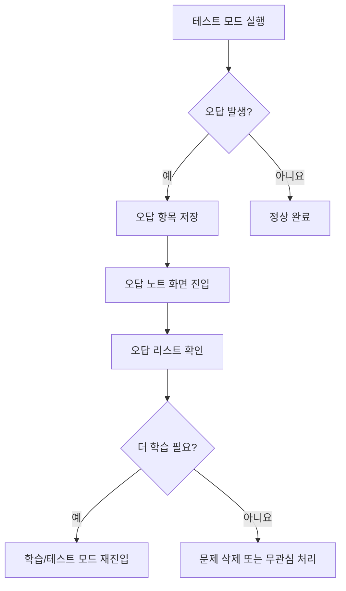

# 오답 노트 (Fail Notebook) 기능 기획서 📝

## 1. 개요

### 1.1 배경
- **현재 상황**: 사용자가 특정 카드를 여러 번 학습하고 테스트를 반복해도 지속적으로 틀리는 내용이 있음
- **문제점**: 
  - 어떤 문제를 잘못 풀었는지 추적 불가
  - 약점 보완에 체계적인 접근 부족
  - 무작위 복습보다는 집중적으로 필요한 내용 복습 필요

### 1.2 목적
- 지속적으로 오답을 내는 학습 항목을 자동으로 수집하고 관리
- 오답률이 높은 항목에 대한 집중 학습 및 복습 지원
- 학습 효율성을 극대화하여 마스터率达到 향상

### 1.3 기대 효과
- **학습자**: 약점 보완 중심의 효율적인 학습 가능
- **개발팀**: 학습 패턴 분석을 통한 개선 포인트 도출
- **시스템**: 스마트한 스팸 (spaced repetition) 기반 복습 스케줄링 준비

---

## 2. 기능 상세

### 2.1 주요 기능

#### 2.1.1 오답 수집 및 기록
- 테스트 모드에서 틀린 모든 문제를 자동으로 기록
- 오답 횟수, 마지막 오류 시간, 카테고리 정보 저장
- 사용자가 수동으로 추가할 수 있는 "더보기" 버튼 제공

#### 2.1.2 오답 노트 화면 (Wrong Answer Screen)
- 오답 항목 리스트 표시 (오답 횟순 정렬)
- 마스터 여부 및 최근 학습 상태 표시
- 각 항목에 대한 상세 보기/수정 기능
- 삭제 기능 (사용자가 완료한 문제 제거)

#### 2.1.3 자동 복습 유도
- 오답률 높은 문제 우선 노출
- 마지막 오류 기준 시간 기반 순차적 복습 제안
- 학습 후 재테스트 기록 및 상태 업데이트

#### 2.1.4 필터링 및 검색
- 카테고리별 오답 보기
- 최근 일주일/한 달/전체 기간별 필터
- 특정 키워드/카테고리로 검색 기능

### 2.2 사용자 흐름 (User Flow)



---

## 3. 아키텍처 설계

### 3.1 파일 구조 추가 계획

```
memory-bread/
├── lib/
│   ├── models/
│   │   └── wrong_answer_item.dart          # [NEW] 오답 항목 데이터 모델
│   ├── screens/
│   │   └── wrong_answer_note_screen.dart    # [NEW] 오답 노트 화면
│   ├── services/
│   │   └── wrong_answer_service.dart        # [NEW] 오답 관리 서비스
│   │   └── storage_service.dart             # 기존: SharedPreferences 로직 확장
│   └── widgets/
│       └── wrong_answer_card_widget.dart    # [NEW] 오답 카드 위젯
├── assets/datasets/
│   └── wrong_answers.json                    # [OPTIONAL] 초기 데이터셋 (선택)
└── doc/
    └── plan/
        └── wrong_answer_note_feature.md      # [NEW] 이 문서
```

### 3.2 데이터 모델 정의

#### 3.2.1 WrongAnswerItem 모델

```dart
// lib/models/wrong_answer_item.dart

class WrongAnswerItem {
  final String id;              // 고유 ID (cardId + timestamp)
  final String cardId;          // 해당하는 카드의 ID
  final String category;        // 카테고리명
  final Keyword keyword;        // 키워드 정보
  final Explanation explanation; // 설명 정보
  final int wrongCount;         // 오답 횟수
  final DateTime firstWrongTime; // 최초 오답 시간
  final DateTime lastWrongTime;  // 마지막 오답 시간
  bool isMastered;              // 마스터 여부 (오답 횟수가 0 인 경우)
  
  // 생성자, getters/setters 추가...
}
```

### 3.3 서비스 계층 설계

#### 3.3.1 WrongAnswerService 인터페이스

```dart
// lib/services/wrong_answer_service.dart

class WrongAnswerService {
  final SharedPreferences _prefs;
  
  // 오답 항목 수집
  Future<void> recordWrongAnswer(String cardId, KeywordItem keyword);
  
  // 최근 오답 목록 조회 (오답 횟수순 정렬)
  Future<List<WrongAnswerItem>> getRecentWrongAnswers();
  
  // 마스터 처리 (3 회 이상 통과 시)
  Future<void> markAsMastered(String id);
  
  // 문제 삭제
  Future<void> removeProblem(String id);
  
  // 카테고리별 필터링 조회
  Future<List<WrongAnswerItem>> getFilteredByCategory(String category);
  
  // 전체 통계 정보 제공
  WrongAnswerStats getStats();
}

// 데이터 클래스
class WrongAnswerStats {
  final int totalWrongCount;
  final int pendingMasterCount; // 마스터 대기 중 항목 수
  final Map<String, int> countByCategory; // 카테고리별 오답 분포
  // ...
}
```

### 3.4 기존 서비스 연동 수정

#### storage_service.dart 확장 계획

기존에 `SharedPreferences` 를 활용한 데이터 저장 로직을 다음처럼 확장:

```dart
// 기존 키 사용: learning_progress, cards_stats
// 새로운 키 추가: wrong_answers_collection (JSON 형태 저장)
const String _wrongAnswersKey = 'wrong_answers';
```

---

## 4. 구현 일정 (Milestones)

### 📌 Phase 1: 핵심 기능 개발 (우선순위 1) - **2 일**

| 작업 항목 | 우선순위 | 소요 시간 | 담당자 |
|-----------|----------|------------|--------|
| WrongAnswerItem 모델 정의 | 🔴 고 | 0.5 일 | - |
| WrongAnswerService 구현 | 🔴 고 | 1.0 일 | - |
| wrong_answer_note_screen.dart 화면 개발 | 🟡 중 | 0.5 일 | - |
| storage_service.dart 확장 | 🟢 저 | 0.25 일 | - |

### 📌 Phase 2: UI/UX 완성 (우선순위 2) - **1.5 일**

| 작업 항목 | 우선순위 | 소요 시간 | 담당자 |
|-----------|----------|------------|--------|
| WrongAnswerCard 위젯 디자인 | 🟡 중 | 0.75 일 | - |
| 화면 레이아웃 및 반응형 조정 | 🟢 저 | 0.5 일 | - |
| 애니메이션 효과 추가 | 🟢 저 | 0.25 일 | - |

### 📌 Phase 3: 테스트 및 리팩토링 (우선순위 3) - **1 일**

| 작업 항목 | 우선순위 | 소요 시간 | 담당자 |
|-----------|----------|------------|--------|
| 단위 테스트 작성 | 🟡 중 | 0.5 일 | - |
| 통합 테스트 및 버그 수정 | 🔴 고 | 0.5 일 | - |
| 문서화 및 코드 리뷰 | 🟢 저 | 0.25 일 | - |

**총 예상工期: 약 4.75 일 (휴일/여가 시간 제외)**

---

## 5. 테스트 전략

### 5.1 단위 테스트 범위

- `WrongAnswerService`: 저장, 조회, 필터링, 통계 계산
- `storage_service.dart`: 오답 데이터의 SharedPreferences 연동
- 위젯 단위: 레이아웃 응답성, 클릭 이벤트 처리

### 5.2 통합 테스트 시나리오

1. **테스트 → 오답 수집 → 화면 조회** 전체 플로우
2. **오답 노트에서 항목 삭제 → 통계 업데이트** 일관성 검증
3. **카테고리별 필터링** 동작 확인
4. **대용량 데이터 처리**: 100 개 이상 오답 항목 시 성능 테스트

### 5.3 테스트 데이터 구축

```dart
// lib/tests/initial_wrong_answer_data.dart (예시)
List<WrongAnswerItem> get dummyWrongAnswers {
  // 테스트용 예제 데이터 생성
}
```

---

## 6. 리스크 및 대응책

| 리스크 | 영향도 | 발생 확률 | 대응책 |
|--------|--------|-----------|--------|
| 기존 저장소와 충돌 | 🟡 중 | ⭐⭐ 낮음 | `storage_service.dart` 신중하게 확장 설계 |
| 데이터 모델 변경 시 호환성 | 🟡 중 | ⭐⭐⭐ 보통 | 버전 관리 및 마이그레이션 전략 수립 |
| 사용자에게 추가 학습 부담감 | 🟠 고 | ⭐ 높음 | 오답 노트 화면 디자인에 "학습 유도" 톤 유지 |
| 성능 저하 (오답 데이터量大) | 🟢 낮 | ⭐⭐ 낮음 | 필요한 경우 DB 로 전환 고려 (장기 계획) |

### 6.1 회귀 테스트 필수 항목

- [ ] 기존 학습, 테스트 기능 정상 동작
- [ ] SharedPreferences 저장/로드 일관성 유지
- [ ] PWA 설정 및Manifest 호환성 확인

---

## 7. 기술적 고려사항

### 7.1 성능 최적화

- 오답 데이터는 JSON 으로 압축 저장
- 자주 사용하는 최근 N 개 항목만 메모리 로딩
- 리스트 화면은 `ListView.builder` 와 `Sliver` 구조 활용

### 7.2 PWA 및 Web 호환성

- [manifest.json](file:///Users/khanguk/Library/Containers/com.google.Chrome/Data/Cache/com.microsoft.VSCode-ca854843b3f2/index.html/static/generated/manifest.json) 에 오답 노트 관련 메타데이터 추가 (선택)
- Service Worker 캐싱 전략에 오답 데이터 포함 고려

### 7.3 확장성 계획

- **장기**: 오답 데이터를 로컬 DB (SQLite, Hive 등) 로 마이그레이션 검토
- **중기**: 학습 패턴 분석을 위한 통계 지표 추가 (일별/주간 오답 트렌드)

---

## 8. 향후 발전 방향 (Roadmap)

### 📅 Short-term (1~2 주)
- ✅ Phase 1~3 완료
- - UI 및 성능 튜닝
- - 사용성 개선 (사용자 피드백 반영)

### 📅 Medium-term (1~2 개월)
- 스마트 복습 스케줄링 기능 추가
- 카테고리별 마스터률 통계 표시
- 음성/이미지 설명 추가 옵션

### 📅 Long-term (3 개월 이상)
- 머신러닝 기반 학습 패턴 분석
- 커뮤니티 공유 및 랭킹 시스템
- 모바일 앱 포팅 시 고려 사항

---

## 9. 승인 요청

이 기획서 내용이 타당하다면 다음 단계를 진행하겠습니다:

1. **코드 생성**: Phase 1 작업 시작 (모델, 서비스, 화면)
2. **PR 등록**: Pull Request 로 코드 리뷰 요청
3. **테스트 및 배포**: 통합 테스트 후 Production 브랜치에 머지

승인해 주시면 바로 개발을 시작하겠습니다! 💪🍞